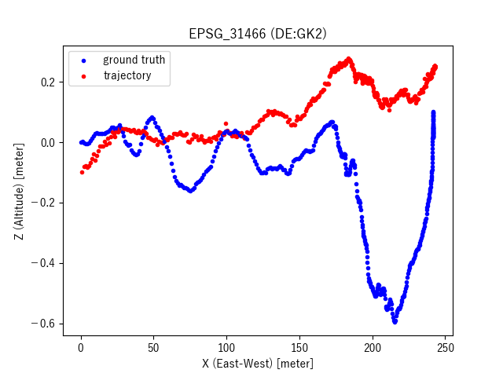

# Monocular 3D Localization in Road Scenes (OpenCV example code for Visual SLAM)

### Description

This example code is a text clustering using BERT embeddings.

### Dependencies
- Python 3.7
- OpenCV 3.4
- [ORB_SLAM2](https://github.com/raulmur/ORB_SLAM2)

In addition, please add the project folder to PYTHONPATH and `conca install` the following packages:
- `cv2`
- `scipy`
- `matplotlib`
- `pyproj`

### Usage ###

### Preparation ###

**Data**

- [The KITTI Vision Benchmark Suite](http://www.cvlibs.net/datasets/kitti/eval_tracking.php):

  - [Download](http://www.cvlibs.net/download.php?file=data_tracking_image_2.zip) left color images of tracking data set (15 GB)
  - [Download](http://www.cvlibs.net/download.php?file=data_tracking_calib.zip) camera calibration matrices of tracking data set (1 MB)
  - [Download](http://www.cvlibs.net/download.php?file=data_tracking_oxts.zip) GPS/IMU data, if you want to use map information (8 MB)
  - [Download](http://www.cvlibs.net/download.php?file=data_tracking_label_2.zip) training labels of tracking data set (9 MB)
  - Create datasets and put them in the appropriate place.

```
datasets/
└── data_tracking
    ├── data_tracking_calib
    │   └── training
    │       └── calib
    │           └── 0001.txt
    ├── data_tracking_image_2
    │   └── training
    │       └── image_02
    │           └── 0001
    │               ├── 000000.png
    │               ├── 000001.png
    │               ├── 000002.png
    │               ├──  :
    │               └── 000446.png
    ├── data_tracking_label_2
    │   └── training
    │       └── label_02
    │           └── 0001.txt
    └── data_tracking_oxts
        └── training
            └── oxts
                └── 0001.txt
```
```
cat datasets/data_tracking/data_tracking_label_2/training/label_02/0001.txt \
| grep "Car " | cut -d " " -f 1-3,7-10 | head -n 5

0 0 Car 776.295323 167.346734 1241.000000 374.000000
0 1 Car 716.495068 179.216697 856.320367 270.111097
0 2 Car 687.583620 178.796339 758.801387 236.853238
0 3 Car 386.049683 192.243034 463.188613 244.957603
0 4 Car 496.360260 189.120921 527.364453 212.930471
```
```
mkdir -p outputs/images

python bbox_viewer.py \
--image_dir  datasets/data_tracking/data_tracking_image_2/training/image_02/0001 \
--label_file datasets/data_tracking/data_tracking_label_2/training/label_02/0001.txt \
--output_dir outputs/images

ffmpeg -r 10 -i outputs/images/bbox-%04d.png -vf "scale=trunc(iw/2)*2:trunc(ih/2)*2" -vcodec libx264 -pix_fmt yuv420p -r 10 outputs/bbox.mp4
ffmpeg -i bbox.mp4 -an -r 10 outputs/temp/%04d.png
convert outputs/temp/*.png -resize 50% outputs/temp/output_%04d.png
convert outputs/temp/output_*.png outputs/bbox.gif 
```


- Run [OpenVSLAM](https://github.com/xdspacelab/openvslam) to output a pose file `keyframe_trajectory.txt`.

```
mkdir -p datasets/data_tracking/sequences/01
ln -s datasets/data_tracking_image_2/training/image_02/0001 datasets/data_tracking/sequences/01/image_0
seq 0.0 0.1 44.7 > datasets/data_tracking/sequences/01/times.txt
cp /path_to_ORB_SLAM2/Examples/Monocular/KITTI04-12.yaml datasets/data_tracking/tracking-0001.yaml
```

- Edit `tracking-0001.yaml` by referring to `calib/001.txt`.  Finally the layout of files is as follows:

```
datasets
└── data_tracking
    ├── tracking-0001.yaml
    └── sequences
        └── 01
            ├── image_0
            │   ├── 000000.png
            │   ├── 000001.png
            │   ├── 000002.png
            │   ├──  :
            │   └── 000446.png
            └── times.txt
```
- Run ORB_SLAM2 and get the pose. (`frameTrajectory.txt`)

```
SLAM=/path_to_ORB_SLAM2; \
${SLAM}/Examples/Monocular/mono_kitti \
${SLAM}/Vocabulary/ORBvoc.txt \
datasets/data_tracking/tracking-0001.yaml \
datasets/data_tracking/sequences/01
```

- Calucurate transformation matrix using Umeyama's approach. (`umeyama.txt`)

```
cat datasets/data_tracking/data_tracking_oxts/training/oxts/0001.txt | cut -d " " -f 1-3 > outputs/gt-trajectory-0001.txt
cat outputs/frameTrajectory.txt | cut -d " " -f 2-4 > outputs/est-trajectory-0001.txt
python plot_umeyama3d.py --gt outputs/gt-trajectory-0001.txt --est outputs/est-trajectory-0001.txt > outputs/umeyama.txt

R[0,0] R[0,1] R[0,2] t[0] R[1,0] R[1,1] R[1,2] t[1] R[2,0] R[2,1] R[2,2] t[2] s
-0.261392 0.027647 0.964837 4.624747 -0.962645 0.065678 -0.262680 -1.049018 -0.070631 -0.997458 0.009446 -0.087966 21.330576
```

|3D|X-Z|X-Y| 
|---|---|---|
||||

- Estimate 3D position using camera poses. (`frameTrajectory.txt`)

```
python 3dm_poses.py \
--label_file datasets/data_tracking/data_tracking_label_2/training/label_02/0001.txt \
--calib_file datasets/data_tracking/data_tracking_calib/training/calib/0001.txt \
--pose_file outputs/frameTrajectory.txt \
--transform_file outputs/umeyama.txt \
| tee outputs/result-3dm_poses.txt
```

- Experiment’s results

```
cat outputs/result-3dm_poses.txt
track_id	object_type	utw1_x	utw1_y	utw1_z	utw2 x	utw2 y	utw2_z	uXw_x	uXw_y	uXw_z
1	Car	5.674826	-1.334792	-0.079794	8.829640	-2.184323	-0.056986	15.269577	-6.866550	-1.026345
2	Car	7.780750	-1.896389	-0.062476	13.015602	-3.293076	-0.053364	21.332943	-8.466352	-1.010641
3	Car	7.780750	-1.896389	-0.062476	14.059823	-3.567164	-0.045905	27.951963	-1.304364	-0.910986
:
```

|3D|X-Z|X-Y| 
|---|---|---|
||||
