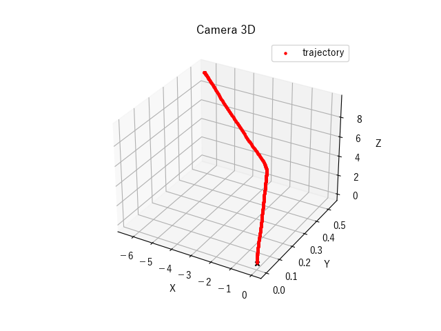
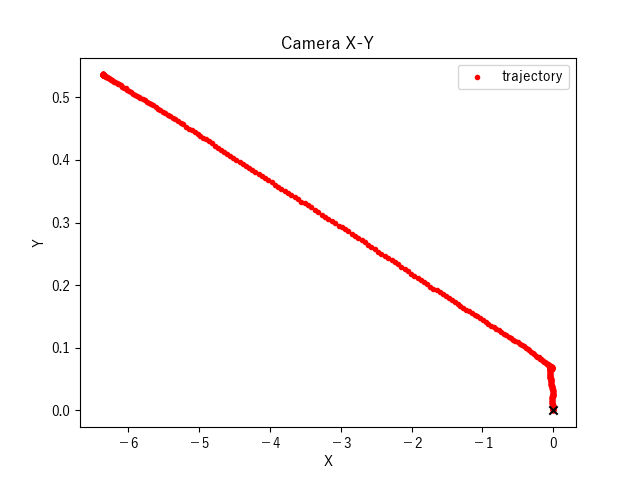
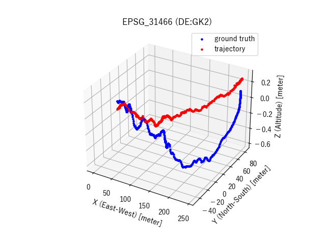
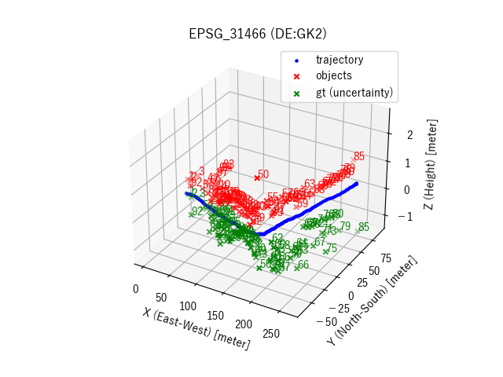
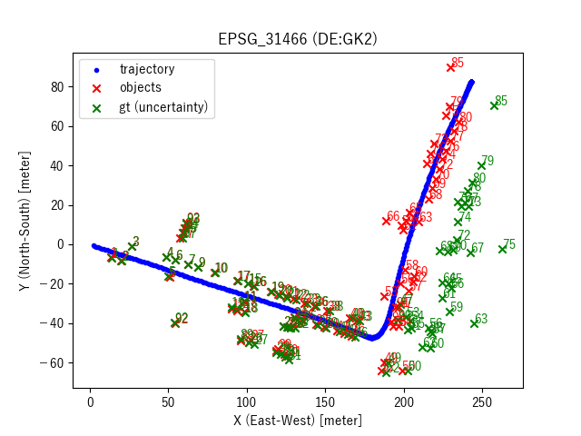

# Monocular 3D Localization in Road Scenes (OpenCV example code for Visual SLAM)

### Description

This example code is a OpenCV example code for Visual SLAM.

### Dependencies
- Python 3.7
- OpenCV 3.4
- [ORB_SLAM3](https://github.com/UZ-SLAMLab/ORB_SLAM3)

In addition, please add the project folder to PYTHONPATH and `conca install` the following packages:
- `cv2`
- `scipy`
- `matplotlib`
- `pyproj`

### ToDo ###

- [x] A fairly naive implementation (including moving objects).
- [x] Object position estimation excluding moving objects. (track# 8 12 44 45 81 82 83 84 86 87 88 96)
- [x] Consider camera height. (1.65 m)
- [ ] Evaluation using the location of the tracking dataset.

### Usage ###

### Preparation ###

**Data**

- [The KITTI Vision Benchmark Suite](http://www.cvlibs.net/datasets/kitti/eval_tracking.php):

  - [Download](http://www.cvlibs.net/download.php?file=data_tracking_image_2.zip) left color images of tracking data set (15 GB)
  - [Download](http://www.cvlibs.net/download.php?file=data_tracking_calib.zip) camera calibration matrices of tracking data set (1 MB)
  - [Download](http://www.cvlibs.net/download.php?file=data_tracking_oxts.zip) GPS/IMU data, if you want to use map information (8 MB)
  - [Download](http://www.cvlibs.net/download.php?file=data_tracking_label_2.zip) training labels of tracking data set (9 MB)
  - Create datasets and put them in the appropriate place.

```
datasets/
└── data_tracking
    ├── data_tracking_calib
    │   └── training
    │       └── calib
    │           └── 0001.txt
    ├── data_tracking_image_2
    │   └── training
    │       └── image_02
    │           └── 0001
    │               ├── 000000.png
    │               ├── 000001.png
    │               ├── 000002.png
    │               ├──  :
    │               └── 000446.png
    ├── data_tracking_label_2
    │   └── training
    │       └── label_02
    │           └── 0001.txt
    └── data_tracking_oxts
        └── training
            └── oxts
                └── 0001.txt
```
```
cat datasets/data_tracking/data_tracking_label_2/training/label_02/0001.txt \
| grep "Car " | cut -d " " -f 1-3,7-10 | head -n 5

0 0 Car 776.295323 167.346734 1241.000000 374.000000
0 1 Car 716.495068 179.216697 856.320367 270.111097
0 2 Car 687.583620 178.796339 758.801387 236.853238
0 3 Car 386.049683 192.243034 463.188613 244.957603
0 4 Car 496.360260 189.120921 527.364453 212.930471
```
```
mkdir -p outputs/images

python bbox_viewer.py \
--image_dir  datasets/data_tracking/data_tracking_image_2/training/image_02/0001 \
--label_file datasets/data_tracking/data_tracking_label_2/training/label_02/0001.txt \
--output_dir outputs/images

ffmpeg -r 10 -i outputs/images/bbox-%04d.png -vf "scale=trunc(iw/2)*2:trunc(ih/2)*2" -vcodec libx264 -pix_fmt yuv420p -r 10 outputs/bbox.mp4
ffmpeg -i bbox.mp4 -an -r 10 outputs/temp/%04d.png
convert outputs/temp/*.png -resize 50% outputs/temp/output_%04d.png
convert outputs/temp/output_*.png outputs/bbox.gif 
```


- Run [ORB_SLAM3](https://github.com/UZ-SLAMLab/ORB_SLAM3) to output a pose file `frameTrajectory.txt`.

```
mkdir -p datasets/data_tracking/sequences/01
ln -s datasets/data_tracking_image_2/training/image_02/0001 datasets/data_tracking/sequences/01/image_0
seq 0.0 0.1 44.7 > datasets/data_tracking/sequences/01/times.txt
cp /path_to_ORB_SLAM2/Examples/Monocular/KITTI04-12.yaml datasets/data_tracking/tracking-0001.yaml
```

- Edit `tracking-0001.yaml` by referring to `calib/001.txt`.  Finally the layout of files is as follows:

```
datasets
└── data_tracking
    ├── tracking-0001.yaml
    └── sequences
        └── 01
            ├── image_0
            │   ├── 000000.png
            │   ├── 000001.png
            │   ├── 000002.png
            │   ├──  :
            │   └── 000446.png
            └── times.txt
```
- Run ORB_SLAM3 and get the pose. (`frameTrajectory.txt`)

```
SLAM=/path_to_ORB_SLAM3; \
${SLAM}/Examples/Monocular/mono_kitti \
${SLAM}/Vocabulary/ORBvoc.txt \
datasets/data_tracking/tracking-0001.yaml \
datasets/data_tracking/sequences/01
```

- Calculate transformation matrix by [DE:GK2 (EPSG 31466)](https://wiki.openstreetmap.org/wiki/DE:Gau%C3%9F-Kr%C3%BCger). (`umeyama-EPSG31466.txt`)

```
cat datasets/data_tracking/data_tracking_oxts/training/oxts/0001.txt | cut -d " " -f 1-3 > outputs/gt-trajectory-0001.txt
cat outputs/frameTrajectory.txt | cut -d " " -f 2-4 > outputs/est-trajectory-0001.txt

python plot_umeyama3d.py \
--gt outputs/gt-trajectory-0001.txt \
--est outputs/est-trajectory-0001.txt \
--epsg 31466 \
> outputs/umeyama-EPSG31466.txt

2021-01-11 11:49:45,401 - main - INFO - {
  "gt": "outputs/gt-trajectory-0001.txt",
  "est": "outputs/est-trajectory-0001.txt",
  "epsg": "31466",
  "camera_height": 1.65
}
```
```
cat outputs/umeyama-EPSG31466.txt
R[0,0] R[0,1] R[0,2] t[0] R[1,0] R[1,1] R[1,2] t[1] R[2,0] R[2,1] R[2,2] t[2] s
-0.256375 0.028110 0.966168 1.053273 -0.963923 0.066591 -0.257717 -0.363450 -0.071582 -0.997384 0.010024 -0.097220 22.325137
```

|Camera 3D|Camera X-Z|Camera X-Y| 
|---|---|---|
||||

|EPSG31466 (DE:GK2) 3D|EPSG31466 (DE:GK2) X-Y|EPSG31466 (DE:GK2) X-Z| 
|---|---|---|
||||

- Estimate 3D position using camera poses (`frameTrajectory.txt`).

```
python 3dm_poses-eval.py \
--label_file datasets/data_tracking/data_tracking_label_2/training/label_02/0001.txt \
--calib_file datasets/data_tracking/data_tracking_calib/training/calib/0001.txt \
--pose_file outputs/frameTrajectory.txt \
--transform_file outputs/umeyama-EPSG31466.txt \
--exclude_objects 8 12 44 45 81 82 83 84 86 87 88 96 \
| tee outputs/result-3dm_poses-eval.txt

2020-03-08 18:49:34,255 - main - INFO - {
  "label_file": "datasets/data_tracking/data_tracking_label_2/training/label_02/0001.txt",
  "calib_file": "datasets/data_tracking/data_tracking_calib/training/calib/0001.txt",
  "pose_file": "outputs/frameTrajectory.txt",
  "transform_file": "outputs/umeyama-EPSG31466.txt",
  "output_dir": "outputs",
  "exclude_objects": [ 8, 12, 44, 45, 81, 82, 83, 84, 86, 87, 88, 96 ]
2021-01-11 11:56:15,937 - main - INFO - {
  "label_file": "datasets/data_tracking/data_tracking_label_2/training/label_02/0001.txt",
  "calib_file": "datasets/data_tracking/data_tracking_calib/training/calib/0001.txt",
  "pose_file": "outputs/frameTrajectory.txt",
  "transform_file": "outputs/umeyama-EPSG31466.txt",
  "output_dir": "outputs",
  "exclude_objects": [8, 12, 44, 45, 81, 82, 83, 84, 86, 87, 88, 96],
  "camera_height": 1.65
}
2021-01-11 11:56:15,938 - main - INFO - --- K ----------
2021-01-11 11:56:15,938 - main - INFO - [[721.5377   0.     609.5593]
 [  0.     721.5377 172.854 ]
 [  0.       0.       1.    ]]
2021-01-11 11:56:15,938 - main - INFO - --- dist_coef ----------
2021-01-11 11:56:15,938 - main - INFO - [[0. 0. 0. 0. 0.]]
:
```

- Experiment’s results

```
cat outputs/result-3dm_poses-eval.txt
track_id	object_type	utw1_x	utw1_y	utw1_z	utw2 x	utw2 y	utw2_z	uXw_x	uXw_y	uXw_z	ulw1_x	ulw1_y	ulw1_z	ulw2 x	ulw2 y	ulw2_z	error
1	Car	3.259275	-0.966023	-0.081054	6.544175	-1.894785	-0.067088	13.258957	-6.667819	-1.070431	14.184595	-6.861387	-1.692258	14.245152	-6.901980	-1.651233	1.160367
2	Car	5.467335	-1.579211	-0.077611	10.989427	-2.988082	-0.039046	19.686182	-8.356985	-1.047002	20.148460	-8.396473	-1.644757	20.284641	-8.396473	-1.631077	1.008312
3	Car	5.467335	-1.579211	-0.077611	12.074421	-3.247233	-0.029041	26.646099	-0.794050	-0.944460	26.746033	-0.852897	-1.551020	26.998493	-0.877923	-1.496542	1.121371
:
```

|3D|X-Y|X-Z|
|---|---|---|
||||

*Note: 3D object location x,y,z "gt" is relative camera position in unknown camera coordinates (in meters). However, the only camera coordinates we know are what we estimated.